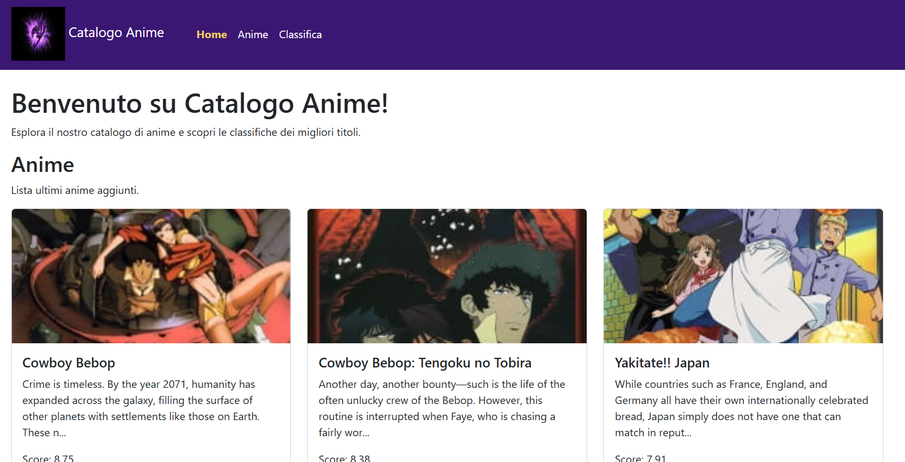
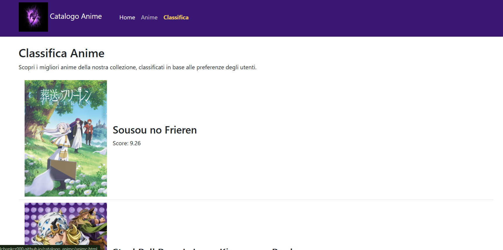

# Catalogo Anime

Questa repository mostra un catalogo di anime che utilizza le API di Jikan per popolare il sito con dati sugli anime.
Il progetto è un esempio di sito statico.

## Screenshot

#### Homepage



#### Lista Anime


#### Classifica



## Demo

Il sito è disponibile online all'indirizzo: [catalogo-anime](https://codebanker000.github.io/catalogo-anime/)

## Funzionalità

Il progetto espone queste funzionalità:

- sito statico con multipagina
- homepage che dove è presente la list degli ultimi anime aggiunti al catalogo
- pagina della classifica che mostra i migliori anime del catalogo
- pagina con la lista completa degli anime del catalogo
- integra un design per anche dispositivi mobili

## Tecnologie utilizzate

- HTML
- CSS e Bootstrap (per il design e la responsività del sito)
- JavaScript (per recuperare i dati dalle API e popolare le pagine)

## Requisiti

- Browser moderno per poter navigare su internet
- Connessione a internet (per Bootstrap e per recuperare i dati dalle API)
- Git installato (per clonare la repository)

## Api utilizzate

| Risorsa       | Endpoint                                            | Uso nel sito           |
|---------------|-----------------------------------------------------|------------------------|
| Anime         | <https://api.jikan.moe/v4/anime>                    | Pagina index.html      |
| Anime Naruto  | <https://api.jikan.moe/v4/anime?q=naruto&limit=12>  | Pagina autori.html     |
| Top Anime     | <https://api.jikan.moe/v4/anime/top>                | Pagina classifica.html |

## Struttura

Il progetto è organizzato in questo modo:

```
└── 📁catalogo-anime
    └── 📁assets
        └── 📁images #tutte le immagini per il layout del sito
            ├── logo-anime.webp
    └── 📁docs
        ├── api.md #documentazione per le API utilizzate
        ├── faq.md #domande frequenti
        ├── installazione.md #documentazione per l'installazione del progetto
    └── 📁scripts
        ├── classifica.js #script per la pagina classifica.html
        ├── home.js #script per la pagina index.html
        ├── script.js #script per la pagina anime.html
    └── 📁styles
        ├── style.css #stile personalizzato per il sito
    ├── .gitignore #file per ignorare i file non necessari nella repository
    ├── anime.html #pagina per visualizzare la lista degli anime
    ├── classifica.html #pagina per visualizzare la classifica degli anime
    ├── data.json #file JSON con i dati degli anime se le API non sono disponibili
    ├── index.html #pagina principale del sito
    ├── LICENSE.txt #licenza del progetto
    └── README.md #documentazione del progetto
```

## Documentazione

- [Installazione](./docs/installazione.md)
- [FAQ](./docs/faq.md)
- [API](./docs/api.md)

## Autore

Matteo Tancredi

## LICENSE

Il codice è rilasciato sotto la licenza MIT. Vedi il file LICENSE per maggiori dettagli. Scelto per permettere a chiunque di utilizzare, modificare e distribuire il codice liberamente, con l'unica condizione di includere la stessa licenza e attribuzione negli eventuali progetti derivati.
